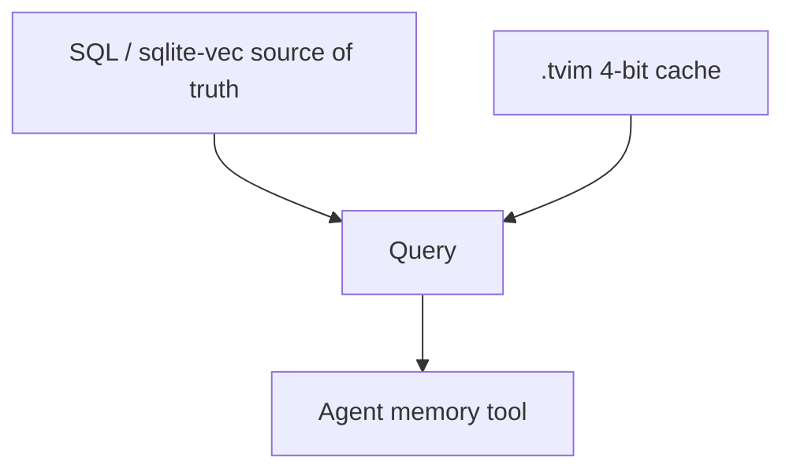

# CynicVec

**If you only open one file, open [`START_HERE.md`](START_HERE.md).**


**One sentence:** CynicVec is a 4-bit approximate nearest-neighbor **cache**
beside a real vector table. If the cache is missing, search still works.
If a save would halve a large index, it **aborts**.

**Value proposition:** Most “we added a vector DB” stories make the ANN
authoritative. A bad dual-write then deletes overnight backfill (“RAG went
stupid at 3am”). This wrapper **fail-opens** when `turbovec` is missing and
**fail-closes** on a suicidal save.

Suggested GitHub / PyPI name: **`cynicvec`**

## Who it helps

Edge RAG, sqlite-vec users, anyone dual-writing embeddings to an ANN file.

## 10-minute first success

```bash
cd cynicvec
python3 -m pip install -e .
python3 examples/quickstart.py
python3 -m unittest discover -s tests -q
```

Without `turbovec` you should see a **RuntimeError** — that is the contract,
not a broken install.

## How it connects to AI agents

Agents should call **your** `memory_query` tool. That tool queries SQL first,
then `present_ids` ∩ `search(allowlist=)`. Do not expose raw `.tvim` load
from untrusted files in the same process as secrets.



## Hardware / software

Python 3.10+, `numpy`. Optional `turbovec`. No GPU required for the wrapper
(the ANN library may use whatever it uses).

## Layout

`cynicvec.py` · `docs/INTEGRATION.md` · `docs/ADVANCED.md` · `tests/` ·
`examples/quickstart.py` · `scripts/smoke.sh`

## Related

`edge-capacity-gate` (VRAM vs recall) · MIT `LICENSE`

## What others will discover (that demos hide)

These dynamics show up **after** someone else runs this in a real loop.
Ordinary READMEs skip them; they are why the kernel exists.

| Lens | In this kernel |
| ---- | -------------- |
| **Recurring pattern** | ANN is a cache. SQL (or sqlite-vec) stays source of truth. Fail-open on the accelerator only. |
| **Feedback loop** | Empty in-memory index + save() over a huge .tvim → RAG dies at 3am while SQL still has rows. |
| **Hidden incentive** | Making ANN authoritative “simplifies” the stack until the first bad write. Then there is no restore. |
| **Leverage point** | save() refuse if new file < 50% of a >50MB index. present_ids before search(allowlist=). |
| **Asymmetry** | Missing turbovec raises — caller must SQL-KNN. Identity/allowlist must never fail-open the same way. |
| **Cause → effect** | Dual-write without shrink guard clobbers backfill. Guard + SQL-first → recall recoverable. |
| **Opportunity** | Edge RAG builders all hit index clobber. Search: vector index wiped dual write. |
| **Risk if copied blindly** | MCP load_tvim_from_url next to secrets. Treat .tvim as data, not a plugin. |

Deeper case studies: [`docs/ADVANCED.md`](docs/ADVANCED.md). Wiring: [`docs/INTEGRATION.md`](docs/INTEGRATION.md).


## License

MIT.
