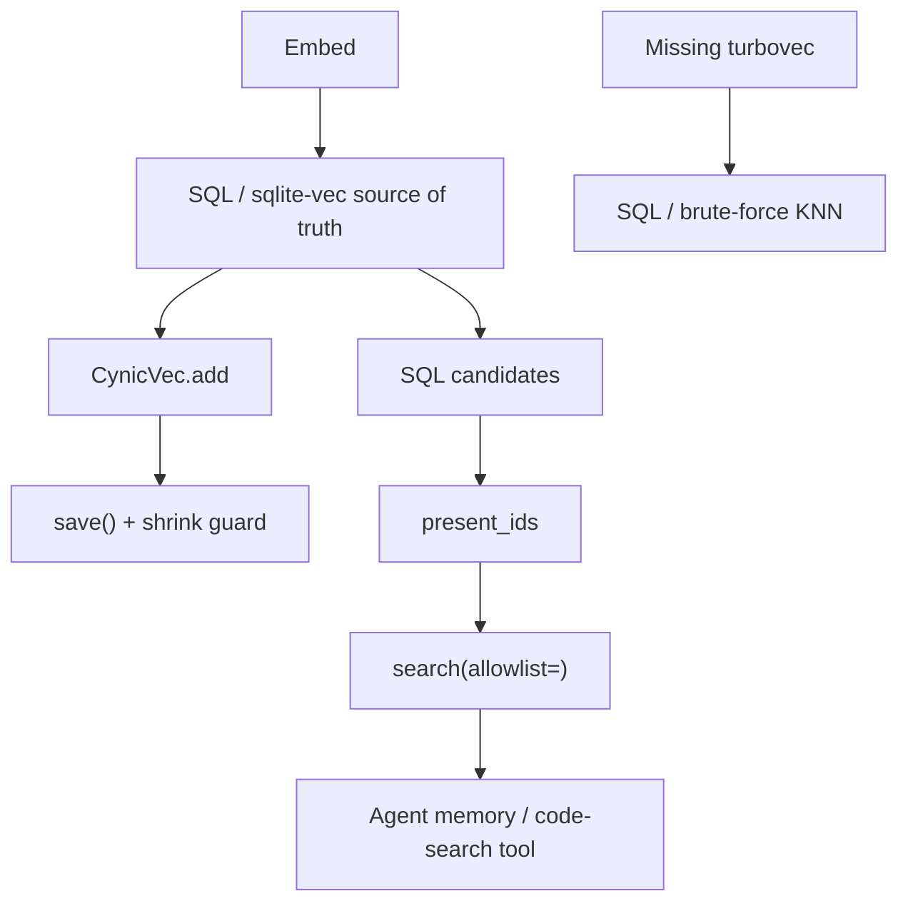

# CynicVec

**If you only open one file, open [`START_HERE.md`](START_HERE.md).**


CynicVec is a 4-bit approximate nearest-neighbor
**cache** beside a real vector table. If the cache is missing, search
still works. If a save would halve a large index, it **aborts**.

sqlite-vec, FAISS, turbovec, and Chroma all persist vectors. None of
them refuse a dual-write that replaces a hundreds-of-MB backfill with
an empty in-memory snapshot. That save looks successful. RAG goes empty
at 3am while SQL still has rows. This wrapper **fail-opens** when
`turbovec` is missing (`RuntimeError` → SQL/KNN) and **fail-closes** on
a suicidal save.

Suggested GitHub / PyPI name: **`cynicvec`**

## Who it helps

| Who | What they get |
| --- | ------------- |
| **You (the technician)** | A shrink-guard `save()` and `present_ids` before `search(allowlist=)`. |
| **AI agents / harnesses** | A `memory_query` that reads SQL first. No `load_tvim_from_url`. |
| **People talking to those agents** | Recall that survives a bad dual-write, because the archive is SQL. |

## Who should skip this

Teams whose vector store is already the only copy (Chroma
`PersistentClient` *is* the database). People who already dual-write
SQL → ANN with a size fuse. Anyone looking for a vector database —
that is sqlite-vec, FAISS, turbovec, or Chroma. This kernel is the
**cache policy**.

## How it connects to AI agents



| Style | When |
| ----- | ---- |
| **Local worker** (recommended) | Dual-write in *your* embed path. Query SQL first. |
| **Harness inspect** | Optional “is cache present?” The model does not load `.tvim`. |
| **Both** | Harness inspects; the daemon owns add/save/search. |

Do **not** expose raw `.tvim` load from untrusted files in the same
process as secrets.

## 10-minute first success

```bash
chmod +x scripts/smoke.sh
./scripts/smoke.sh
# optional
python3 -m pip install -e .
python3 examples/quickstart.py
```

Success is `smoke ok` plus, without turbovec, a **RuntimeError** that
says the caller must use SQL. That rigidity is the product.

## Hardware / software

| Resource | Minimum |
| -------- | ------- |
| OS | Linux, macOS, or Windows with Python **3.10+** |
| RAM | Trivial for the wrapper; the `.tvim` is your ANN’s size |
| GPU | **None** for this kernel (the ANN library may use whatever it uses) |
| Network | **None** for the library itself |

Declared dependency: **numpy**. Optional: **turbovec**. No MCP adapter
ships in this repo.

## Repository layout

| File | What it does | What you change it for |
| ---- | ------------ | ---------------------- |
| `START_HERE.md` | First-use, 10 minutes | You usually do not |
| `README.md` | Product + hidden dynamics | Forks / rename |
| `docs/INTEGRATION.md` | Write/read order | New SQL table |
| `docs/ADVANCED.md` | Dual-write clobber (search article) | Architecture debates |
| `cynicvec.py` | `CynicVec` wrapper | Dim / bit width (rarely) |
| `examples/quickstart.py` | Fail-open demo | Learning |
| `tests/` | Fail-open + shrink-guard constants | Behavior changes |
| `scripts/smoke.sh` | unittest + quickstart | CI locally |
| `.env.example` | Env **names** | Copy to `.env` (never commit `.env`) |

## Related kernels

| Kernel | Why |
| ------ | --- |
| [Curiosity-Docker](https://github.com/CynicalTyr/Curiosity-Docker) | Public house style (START_HERE as the door). Not a vector store. |
| `epistemic-deny` | Tool denies. Missing ANN is not a permission deny — it is fail-open for an accelerator. |
| `agent-review-envelope` | Speech dual-control. Do not Slack from the process that just clobbered an index. |
| `sidecar-occupancy` | HTTP 503 is a lock. This kernel is a cache vs archive split. |
| `gated-rewoo` | Planner skip. Unrelated to ANN persist. |
| `edge-capacity-gate` | Pair when ANN search competes with inference VRAM. Prefer SQL under pressure. |

## What others will discover (that demos hide)

These dynamics show up **after** someone else runs this in a real loop.
Ordinary READMEs skip them; they are why the kernel exists.

| Lens | In this kernel |
| ---- | -------------- |
| **Recurring pattern** | ANN is a cache. SQL (or sqlite-vec) stays source of truth. Fail-open on the accelerator only. |
| **Feedback loop** | Empty in-memory index + `save()` over a huge `.tvim` → RAG dies at 3am while SQL still has rows. Guard + SQL-first → recall recoverable. |
| **Hidden incentive** | Making ANN authoritative “simplifies” the stack (one file, one query path) until the first bad write. Then there is no restore. |
| **Leverage point** | `save()` refuse if new file `<50%` of a `>50 MB` index. `present_ids` before `search(allowlist=)`. |
| **Asymmetry** | Missing turbovec raises — caller must SQL-KNN. Identity/allowlist must **never** fail-open the same way. |
| **Cause → effect** | Dual-write without shrink guard clobbers backfill. Guard + SQL-first → delete `.tvim`, rebuild. |
| **Opportunity** | Edge RAG builders all hit index clobber. Search: *vector index wiped dual write*. |
| **Risk if copied blindly** | MCP `load_tvim_from_url` next to secrets. Treat `.tvim` as data, not a plugin. Copying fail-open onto auth. |

**Hidden principle:** the transformed representation must never redefine
the source. Per the Cynical0n3 NotebookLM (`systems`): fail-open is
only permissible for non-authoritative operations (secondary similarity
scans); mutations that would clobber the archive must abort. A competent
engineer still violates this by calling FAISS `write_index` or turbovec
`IdMapIndex.write` / `_persist.atomic_save` on whatever is in RAM.

**Mental model:** adopters think “the vector index *is* memory.” The
governing model is **SQL is the archive; `.tvim` is a cache**. turbovec
`atomic_save` makes the write atomic (temp + `os.replace`) and checks
sidecar *handles* — it does not compare byte sizes. FAISS
`faiss/index_io.h` `write_index` overwrites the filename. Chroma
`PersistentClient` *is* the store (`chroma.sqlite3`). sqlite-vec `vec0`
*is* SQL. None of those refuse a 300 MB → 4 KB replace.

**Second-order:** once teams copy this, they will measure ANN hit-rate
and treat shrink-guard `RuntimeError` as “save failed, retry with force.”
That metric is the clobber. Count silent size drops (should be zero) vs
loud `save blocked` (should be rare). Do **not** add
`save(force=True)` or `load_tvim_from_url`.

Deeper case studies: [`docs/ADVANCED.md`](docs/ADVANCED.md). Wiring:
[`docs/INTEGRATION.md`](docs/INTEGRATION.md).

## License

MIT. See `LICENSE`.
