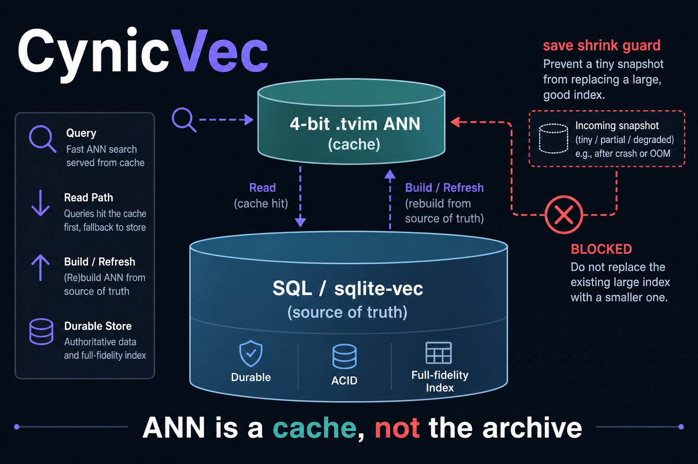

# START HERE

**If you only open one file, open this one.**

This guide assumes you can log into a computer, open a terminal, and paste
commands. It does **not** assume you know Docker, MCP, or how AI agents work.



The ANN file is a **cache**. SQL (or sqlite-vec) keeps
the rows. If the cache is missing, search still works. If a save would
halve a large index, it **aborts**.

## Who this helps

| Who | What they get |
| --- | ------------- |
| **You (learning)** | A 10-minute proof the code runs (`smoke ok`). Missing `turbovec` raising `RuntimeError` is the *correct* fail-open. |
| **An AI harness** | Cursor, Claude Desktop, Copilot Chat — a program that runs a model *and* tools. See §5. |
| **A locally built AI** | Your own Python/timer worker. Function calls. MCP is optional. See §6. |
| **People talking to that AI** | Recall that still works after a bad dual-write, because SQL still has rows. |

A **harness** is Cursor / Claude Desktop / VS Code Copilot — a program that
runs a model and **tools**. A **custom-built AI** is your own Python/timer
worker; HTTP or function calls; MCP optional.

---

## 0. Words you will see, then files

| Word | Plain meaning |
| ---- | ------------- |
| **Harness** | The IDE or app that hosts the model (Cursor, Claude Desktop). It can start **MCP tools**. |
| **MCP** | A way for the model to call small tools. Tools are not automatically safe. |
| **Locally built AI** | Your own loop: your code calls models and functions. You decide the order. |
| **Kernel** | This tiny library. It is not a full chatbot. |
| **ANN cache** | The `.tvim` file. Fast approximate search. **Not** the archive. |
| **SQL / sqlite-vec** | Where embeddings actually live. Delete the cache and you can rebuild. |
| **Fail-open** | Missing `turbovec` raises `RuntimeError`. The **caller** uses SQL/KNN. Do **not** copy this onto auth. |
| **Shrink guard** | `save()` refuses to replace a `>50 MB` index with a file `<50%` as large. |

| File | What it does | What you change it for | How it helps agents / users |
| ---- | ------------ | ---------------------- | --------------------------- |
| `START_HERE.md` | This first-use guide | You usually do not | Humans: how to get `smoke ok` |
| `README.md` | Product + hidden dynamics | Forks / rename | Humans: “is this the right tool?” |
| `docs/hero.png` | Banner | Branding | Humans: 10-second mental model |
| `docs/INTEGRATION.md` | Write/read order + env names | New host / SQL table | Custom AI (primary) |
| `docs/ADVANCED.md` | Dual-write clobber (search article) | Architecture debates | People who already had empty RAG |
| `cynicvec.py` | Wrapper: add / `present_ids` / search / shrink-guard save | Dim / bit width (rarely) | The worker’s only ANN path |
| `examples/quickstart.py` | Missing-`turbovec` fail-open demo | Learning | Proof without an ANN library |
| `tests/` | Fail-open + shrink-guard constants | Behavior changes | Cache miss still signals SQL |
| `scripts/smoke.sh` | unittest + quickstart | CI locally | 10-minute first success |
| `.env.example` | Env **names** | Copy to `.env` (never commit `.env`) | Index path + dim; no secrets |

**Mental picture:**

```
Embed  →  SQL row (source of truth)  →  CynicVec.add  →  save()
Query  →  SQL candidates  →  present_ids  →  search(allowlist=)
Missing turbovec / missing .tvim  →  SQL / brute-force KNN (fail-open)
Suicidal save (empty RAM over a huge .tvim)  →  RuntimeError (keep the file)
```

---

## 1. What you need

- Python 3.10 or newer. Check: `python3 -V`
- Ability to `cd` into this folder (the clone root)
- A throwaway directory for any `AGENT_HOME` (use `/tmp/...`, never a real home)
- Declared dependency: **numpy**. Optional: **turbovec** (the 4-bit ANN). Smoke does **not** need turbovec.

No GPU. No Docker. No API keys for the 10-minute path.

---

## 2. First success (under 10 minutes)

From **this folder** (after clone it is named `cynicvec`):

```bash
chmod +x scripts/smoke.sh
./scripts/smoke.sh
```

You want a line `smoke ok` and no traceback. That script sets `PYTHONPATH`
for you. Optional later:

```bash
python3 -m pip install -e .
cp .env.example .env
python3 examples/quickstart.py
```

**This kernel’s success looks like:** printed `turbovec installed: False`
and `expected fail-open signal:` with a `RuntimeError` telling the caller
to use SQL. That is the contract, not a broken install. If turbovec *is*
installed, quickstart adds one vector, searches, and saves a tiny demo
`.tvim` under `/tmp`.

If `python3` is missing, install Python from python.org or your package
manager, then try again.

---

## 3. How to edit (safe)

Change Python files in *this* folder. Re-run `./scripts/smoke.sh`.

This kernel has **no** MCP server. If you later wrap it in a harness tool,
**restart the harness** after editing that wrapper (the child process is
already running). Do not copy this folder over a live operator machine
“to try it.”

---

## 4. Configure

Copy `.env.example` to `.env` if you want named knobs for *your* worker.
Fill **names you own**. Never commit `.env`.

This library itself has no production token. The names that matter when
*you* dual-write:

- index path (example name `CYNICVEC_INDEX_PATH`)
- vector dim (example name `CYNICVEC_DIM`, often **2048**)
- optional backend switch (example name `MEMORY_VECTOR_BACKEND` /
  `SCARAB_VECTOR_BACKEND`) so you can set `sqlite_vec` and skip the ANN

Keep SQL as source of truth regardless of those names.

---

## 5. Using this with an AI harness (Cursor / Claude Desktop / MCP)

A **harness** is the program that runs the model and its tools. It does
**not** magically import this folder. Keep the kernel in **your daemon**.
The chat model only *inspects* results.

There is **no** `examples/mcp_server.py` on purpose. Do **not** add an MCP
tool that loads a `.tvim` from a URL (or any untrusted path) in the same
process as secrets. Optional inspect-only: “is the cache file present?”
Your `memory_query` / codebase-search tool stays in the daemon.

Paste-ready policy:

> Query SQL (or sqlite-vec) first. Intersect eligible rowids with
> present_ids before search(allowlist=). If CynicVec raises RuntimeError,
> use SQL/KNN — that is fail-open for the accelerator only. Never fail-open
> auth or allowlists the same way. Never expose load_tvim_from_url.
> On save RuntimeError (shrink guard), keep the previous .tvim.

---

## 6. Using this with a locally built AI (no MCP)

Your worker process writes SQL first, then the cache. A *different*
query path reads SQL candidates, then the cache. The chat model is
**not** that worker.

```python
from pathlib import Path
from cynicvec import CynicVec

def get_ann(path: Path, dim: int) -> CynicVec | None:
    try:
        return CynicVec(path, dim=dim)
    except RuntimeError:
        return None  # caller uses SQL / sqlite-vec KNN
```

Write order: **embed → SQL row → `add` → `save()`**.
Read order: **SQL candidates → `present_ids` → `search(allowlist=)`**.

Copy `examples/quickstart.py` into your worker, then replace the demo
path and dim. Catch `RuntimeError` from both construction (missing
turbovec) and `save()` (shrink guard).

Recipes: [`docs/INTEGRATION.md`](docs/INTEGRATION.md).

---

## 7. Practice drills (do these once)

1. Import `CynicVec`. If turbovec is missing, catch `RuntimeError` and
   confirm the caller can still use SQL.
2. Confirm there is **no** MCP tool that loads a `.tvim` from a URL.
3. Read [`docs/ADVANCED.md`](docs/ADVANCED.md) on the shrink guard
   (`>50 MB` and new file `<50%`).
4. Re-run `./scripts/smoke.sh`. It must still pass.
5. Open `docs/ADVANCED.md` once (evergreen / search tutorial). Name one
   comparable that will overwrite a large index with an empty snapshot.

---

## 8. When something is wrong

| Symptom | Try |
| ------- | --- |
| `No module named ...` | Run `./scripts/smoke.sh` from *this* folder (it sets PYTHONPATH), or `pip install -e .` |
| `Permission denied` on smoke.sh | `chmod +x scripts/smoke.sh` |
| `RuntimeError: turbovec not installed` | Expected without the optional extra. Use SQL/KNN. |
| `RuntimeError: cynicvec save blocked` | Shrink guard fired. Keep the previous `.tvim`. Reload from disk; do not `os.replace` yourself. |
| RAG empty, SQL still has rows | Dual-write clobbered the cache. Delete `.tvim` and backfill from SQL. |
| `search(allowlist=)` throws on an id | Call `present_ids` first. Metadata-only rows are normal after partial backfill. |
| Model “loads the index from a URL” | Someone added a tool that bypasses the kernel — see INTEGRATION |

---

## 9. What not to do

- Do not treat the `.tvim` as source of truth (that is how overnight
  backfill dies).
- Do not copy fail-open onto auth, allowlists, or review gates.
- Do not add an MCP tool that loads a `.tvim` from a URL.
- Do not `os.replace` a huge index with a tiny temp yourself after the
  guard raises.
- Do not commit secrets, phones, or live identity YAML.
- Do not treat first success as production-ready without INTEGRATION.

**Risk to remember:** an MCP `load_tvim_from_url` next to secrets treats
the cache as a plugin. Treat `.tvim` as data.

---

## 10. Where to go next

| Need | Open |
| ---- | ---- |
| Why this exists / hidden dynamics | [`README.md`](README.md) |
| Recipes for harness + custom AI | [`docs/INTEGRATION.md`](docs/INTEGRATION.md) |
| Advanced / search tutorials | [`docs/ADVANCED.md`](docs/ADVANCED.md) |
| Extra | Vector backends: fail-open vs fail-closed in ADVANCED |

You are done with first use when smoke prints `smoke ok` and you can say
in one sentence whether **your** agent is a harness, a custom loop, or
both — and that the ANN is a cache, not the archive.
